# ISS Tracker
Have you ever thought about the International Space Station? The permanently manned spacecraft in low orbit of the Earth that travels around the Earth at 17,500 miles per hour and is home to many astronauts and cosmonauts? Have you wondered what latitude and longitude it is directly above? Well, the ISS Tracker does exactly that!

| **Engineer** | **School** | **Area of Interest** | **Grade** |
|:--:|:--:|:--:|:--:|
| Vikram N | Cal High | Aerospace Engineering | Incoming Sophomore


# Picture of Finished ISS Tracker
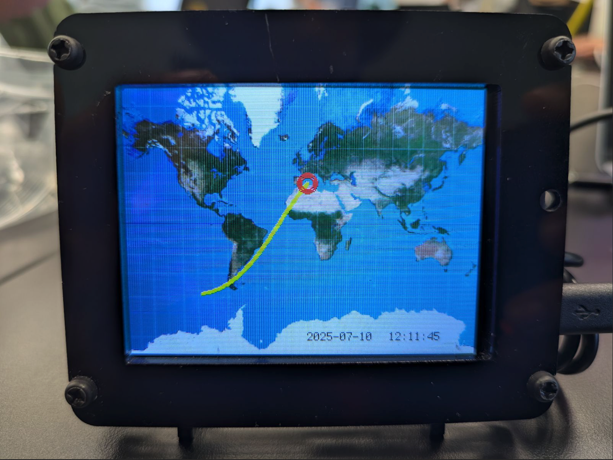

# Modifications


# Final Milestone 

<<iframe width="560" height="315" src="https://www.youtube.com/embed/-hmQWgMjSMQ?si=SLwFndMikW0-HZ1E" title="YouTube video player" frameborder="0" allow="accelerometer; autoplay; clipboard-write; encrypted-media; gyroscope; picture-in-picture; web-share" referrerpolicy="strict-origin-when-cross-origin" allowfullscreen></iframe>>
<!--
For your final milestone, explain the outcome of your project. Key details to include are:
- What you've accomplished since your previous milestone
- What your biggest challenges and triumphs were at BSE
- A summary of key topics you learned about
- What you hope to learn in the future after everything you've learned at BSE
-->
My final milestone was to get the PyPortal to display the current location of the ISS, and the local date and time on a bitmap of the Mercator projection of the Earth. To do that, I had to download the bitmap of the Mercator projection and ensure I had all the correct files for the PyPortal to connect to the internet and retrieve the ISS's location, as well as the local date and time.

I faced several challenges during this milestone, and it was easily the hardest part of the project. My first challenge was that I didn't see that in the code below this section, it already connects to the internet using a PyPortal object. Due to this, I kept the code that used low-level ESP32SPI to connect to the internet, which caused errors because it's like having 2 drivers in the same car seat, one who has established rules and routes, and another driver who turns, brakes, and accelerates independently, leading to an accident. But that was only problem number one. 

The second challenge was that I kept getting an error about line 181 in init.py and an AttributeError about the 'PyPortal' object not having a root group. I didn't know what to do from here, so I asked an instructor. Since I was using TextEdit for the entirety of the project up until that point, the instructor asked me to download Mu Editor, a code editor for Python and its variants such as MicroPython and CircuitPython. However, I was not an administrator on my computer and could not download any applications. I called my dad because he was the administrator and tried to use his password to download Mu Editor, to no avail. Due to this setback, I had to use a slow loaner computer; however, even with an instructor's help, the issue could not be resolved   m mm mmw. Once I got home, I called my father to find the password to download Mu Editor, but we couldn't find it, and ended up resetting our passwords, and he made me an administrator, so I could download Mu Editor and have a better look at the code.

The third challenge was the error concerning line 181 in init.py and an AttributeError about the 'PyPortal' object not having a root group. Nothing I was doing was working, so I went to an instructor, who looked over the issue. We couldn't find the root of the issue, so my instructor advised me to fully reset the PyPortal to get the starting set of files, since the error only happened if I had accidentally deleted a necessary file that couldn't be downloaded from the internet. I tried doing that, however, I kept getting the same set of files I had, leading to the error popping up each time I ran the code. No matter how much I researched, I still could not find a way to fully reset the PyPortal. I went to get the help of another instructor to help me. What I didn't know was that he had done this project before, and fully reset the PyPortal and got all the required files and code to work with ease. After he had troubleshooted the problem, I put in the code (see below) into Mu Editor, and it successfully displayed the current position of the ISS and the local date and time on a Mercator bitmap.

```python
# The time module allows for formatting and tracking time 
import time
# The math module is used for calculations such as converting latitude and longitude into coordinates on the screen
import math
# The board module is used for providing access to hardware pins on the screen
import board
# The displayio module is used for handling graphics and layouts on the screen
import displayio
# FONT is the built-in terminal font
from terminalio import FONT
# The PyPortal module is a high-level library used for managing internet access, display, and JSON fetching
from adafruit_pyportal import PyPortal
# Circle is imported to draw a circular marker
from adafruit_display_shapes.circle import Circle
# Label is imported to place text on the display
from adafruit_display_text.label import Label

# Radius of the ring-like ISS Marker
MARK_SIZE = 10
# Color of the ring-like ISS Marker (0xFF3030 is Red)          
MARK_COLOR = 0xFF3030
# The thickness of the ring-like ISS Marker
MARK_THICKNESS = 5
# How many past positions of the ISS the PyPortal must display
TRAIL_LENGTH = 200
# The color of the ISS's current and past positions (0xFFFF00 is yellow)
TRAIL_COLOR = 0xFFFF00
# The color of the text that displays the date
DATE_COLOR = 0x111111
# The color of the text that displays the time
TIME_COLOR = 0x111111
# The vertical latitude range for the map
LAT_MAX = 80
# How many seconds it takes for the map to update
UPDATE_RATE = 10         

# This is the URL for the ISS location API
DATA_SOURCE = "http://api.open-notify.org/iss-now.json"
# This 
DATA_LOCATION = ["iss_position"]

WIDTH = board.DISPLAY.width
HEIGHT = board.DISPLAY.height


cwd = ("/"+__file__).rsplit('/', 1)[0]
pyportal = PyPortal(url=DATA_SOURCE,
                    json_path=DATA_LOCATION,
                    status_neopixel=board.NEOPIXEL,
                    text_font=None,
                    default_bg=cwd+"/map.bmp") # This sets the Mercator projection bitmap as the background

# Connect to the internet and get local time
pyportal.get_local_time()

# Date and time label
date_label = Label(FONT, text="0000-00-00", color=DATE_COLOR, x=165, y=223)
time_label = Label(FONT, text="00:00:00", color=TIME_COLOR, x=240, y=223)
pyportal.splash.append(date_label)
pyportal.splash.append(time_label)

# ISS trail
trail_bitmap = displayio.Bitmap(3, 3, 1)
trail_palette = displayio.Palette(1)
trail_palette[0] = TRAIL_COLOR
trail = displayio.Group()
pyportal.splash.append(trail)

# ISS location marker
marker = displayio.Group()
for r in range(MARK_SIZE - MARK_THICKNESS, MARK_SIZE):
    marker.append(Circle(0, 0, r, outline=MARK_COLOR))
pyportal.splash.append(marker)

def get_location(width=WIDTH, height=HEIGHT):
    """Fetch current lat/lon, convert to (x, y) tuple scaled to width/height."""

    # Get location
    try:
        location = pyportal.fetch()
    except RuntimeError:
        return None, None

    # Compute (x, y) coordinates
    lat = float(location["latitude"])   # degrees, -90 to 90
    lon = float(location["longitude"])  # degrees, -180 to 180

    # Scale latitude for cropped map
    lat *= 90 / LAT_MAX

    # Mercator projection math
    # https://stackoverflow.com/a/14457180
    # https://en.wikipedia.org/wiki/Mercator_projection#Alternative_expressions
    x = lon + 180
    x = width * x / 360

    y = math.radians(lat)
    y = math.tan(math.pi / 4 + y / 2)
    y = math.log(y)
    y = (width * y) / (2 * math.pi)
    y = height / 2 - y

    return int(x), int(y)

def update_display(current_time, update_iss=False):
    """Update the display with current info."""

    # ISS location
    if update_iss:
        x, y = get_location()
        if x and y:
            marker.x = x
            marker.y = y
            if len(trail) >= TRAIL_LENGTH:
                trail.pop(0)
            trail.append(displayio.TileGrid(trail_bitmap,
                                            pixel_shader=trail_palette,
                                            x = x - 1,
                                            y = y - 1) )


    # Date and time
    date_label.text = "{:04}-{:02}-{:02}".format(current_time.tm_year,
                                                 current_time.tm_mon,
                                                 current_time.tm_mday)
    time_label.text = "{:02}:{:02}:{:02}".format(current_time.tm_hour,
                                                 current_time.tm_min,
                                                 current_time.tm_sec)

    try:
        board.DISPLAY.refresh(target_frames_per_second=60)
    except AttributeError:
        board.DISPLAY.refresh_soon()


# Initial refresh
update_display(time.localtime(), True)
last_update = time.monotonic()

# Run forever
while True:
    now = time.monotonic()
    new_position = False
    if now - last_update > UPDATE_RATE:
        new_position = True
        last_update = now
    update_display(time.localtime(), new_position)
    time.sleep(0.5)


```
# Second Milestone
<iframe width="560" height="315" src="https://www.youtube.com/embed/8KgjXdQiv_Y?si=oTuHQKYGt_8P7KV_" title="YouTube video player" frameborder="0" allow="accelerometer; autoplay; clipboard-write; encrypted-media; gyroscope; picture-in-picture; web-share" referrerpolicy="strict-origin-when-cross-origin" allowfullscreen></iframe>


# Summary of Second Milestone Build Process
My second milestone was connecting the Adafruit PyPortal to the Internet to find and track the ISS's location. To do that, I had to create a settings.toml file. One would create a settings.toml file to make sure one can share their code without sharing their sensitive network information. The settings.toml file contains the name of the network and its password, while the code.py file imports the variables by importing the os library with "import os" and uses them to connect to the internet. A surprising aspect of this project so far has been that my first two milestones have primarily been preparations for the third milestone, where I anticipate the bulk of the work will be.

One challenge I faced in this milestone was that my code failed several times. When making my settings. When testing the toml file with a test variable, the code.py file failed to import and print the test variable. I attempted to troubleshoot the issue by testing each line individually to identify the faulty one. But when I typed them in that way to find out which one was faulty, they all worked. Now, one of the ways I think it didn't work before was because I messed up the quotation marks, changing what were the variable names and what were the actual values of the variables themselves. After I cleared that up, I misread the instructions to create the code that connects the PyPortal to the wifi. The instructions told me to input the code in the code.py file I've been using since the beginning of the project, but I created another file called code.py (which was also created incorrectly), and inputted the code incorrectly. This created a duplicate code.py file, which had faulty code. Whenever I tried to run my settings.toml code, I kept getting errors on code.py. The problems kept persisting until I tracked down and deleted the faulty file. After I did that, the code finally worked.

The next milestone is getting the PyPortal to track the location of the ISS and display it on a map.

# Code
```python
#This imports the os module, allowing access to file paths, environment tables, and system-level functions.
import os
#getnev() get environment variables. In CircuitPython, this usually refers to values in a settings.toml file, usually WiFi credentials
from os import getenv

#This helps manage networking with different backends like ESP32.
import adafruit_connection_manager
#This imports a simplified HTTP request library similar to Python's requests.
import adafruit_requests
#This maps hardware pins on your board
import board
#This is used to initialize the SPI bus
import busio
#This sets pins as digital inputs and digital outputs
from digitalio import DigitalInOut
#This provides classes and functions for drawing graphics to the screen
import displayio
#This allows loading custom .bdf or .pcf bitmap fonts for display text (However, this is not used in the code)
from adafruit_bitmap_font import bitmap_font
#This is the core library for controlling the ESP32 WiFi co-processor over SPI
from adafruit_esp32spi import adafruit_esp32spi

#Loads the WiFi credentials from the settings.toml file and keeps them out of the code
ssid = getenv("CIRCUITPY_WIFI_SSID")
password = getenv("CIRCUITPY_WIFI_PASSWORD")

#This is the debug message printed when the program starts running
print("ESP32 SPI webclient test")

#These are URLs hosted by AdaFruit for basic connectivity and JSON pairing tests 
TEXT_URL = "http://wifitest.adafruit.com/testwifi/index.html"
JSON_URL = "http://wifitest.adafruit.com/testwifi/sample.json"

#Sets up the chip-select, busy, and reset pins to control the ESP32 Module
esp32_cs = DigitalInOut(board.ESP_CS)
esp32_ready = DigitalInOut(board.ESP_BUSY)
esp32_reset = DigitalInOut(board.ESP_RESET)

#Some boards (like SCK1) support multiple SPI ports. The code picks the secondary one if it exists, or else it defaults to the primary
if "SCK1" in dir(board):
    spi = busio.SPI(board.SCK1, board.MOSI1, board.MISO1)
else:
    spi = busio.SPI(board.SCK, board.MOSI, board.MISO)
# Initializes communication with the ESP32 over SPI using previously defined pins
esp = adafruit_esp32spi.ESP_SPIcontrol(spi, esp32_cs, esp32_ready, esp32_reset)

#This sets up socketpool for internet communication
pool = adafruit_connection_manager.get_radio_socketpool(esp)
#This sets up ssl_context for HTTPS
ssl_context = adafruit_connection_manager.get_radio_ssl_context(esp)
#This sets up the requests session for sending HTTP GET/POST requests
requests = adafruit_requests.Session(pool, ssl_context)

# This prints a status message if ESP isn't connected but is detected
if esp.status == adafruit_esp32spi.WL_IDLE_STATUS:
    print("ESP32 found and in idle mode")
# This prints the ESP32 firmware version and MAC address
print("Firmware vers.", esp.firmware_version)
print("MAC addr:", ":".join("%02X" % byte for byte in esp.MAC_address))

# This searches for all available WiFi networks and displays them alongside their respective signal strengths
for ap in esp.scan_networks():
    print("\t%-23s RSSI: %d" % (ap.ssid, ap.rssi))

# This line of code attempts to connect to the specified WiFi network and automatically retries upon encountering an error
print("Connecting to AP...")
while not esp.is_connected:
    try:
        esp.connect_AP(ssid, password)
    except OSError as e:
        print("could not connect to AP, retrying: ", e)
        continue

# This prints the connected SSID and its signal strength 
print("Connected to", esp.ap_info.ssid, "\tRSSI:", esp.ap_info.rssi)
# This prints the assigned IP address
print("My IP address is", esp.ipv4_address)
# This looks up the IP address for adafruit.com and pings google.com
print("IP lookup adafruit.com: %s" % esp.pretty_ip(esp.get_host_by_name("adafruit.com")))
print("Ping google.com: %d ms" % esp.ping("google.com"))

# This performs an HTTP GET request to fetch plain text, prints the response, and closes the connection
print("Fetching text from", TEXT_URL)
r = requests.get(TEXT_URL)
print("-" * 40)
print(r.text)
print("-" * 40)
r.close()

# This does the same as the above code, except it fetches a JSON response, which r.json() parses and it returns a dictionary
print()
print("Fetching json from", JSON_URL)
r = requests.get(JSON_URL)
print("-" * 40)
print(r.json())
print("-" * 40)
r.close()

# Printed upon completion of the code
print("Done!")


```
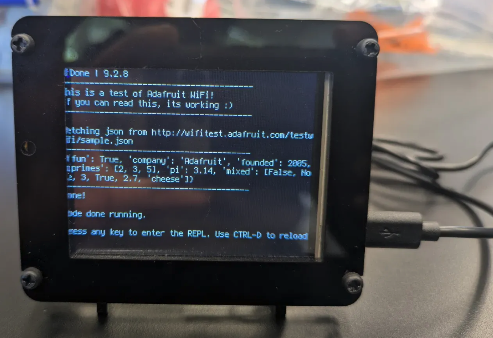

(Above) This is the PyPortal, currently connected to the internet


# First Milestone
<iframe width="560" height="315" src="https://www.youtube.com/embed/YfIg-njLHq4?si=V05FRoKpC91G4Krp" title="YouTube video player" frameborder="0" allow="accelerometer; autoplay; clipboard-write; encrypted-media; gyroscope; picture-in-picture; web-share" referrerpolicy="strict-origin-when-cross-origin" allowfullscreen></iframe>

# Summary of First Milestone Build Process
The project tracks the position of the International Space Station and tells you the location on Earth that the ISS is directly above using the Internet. The PyPortal displays the location and holds the code. The PyPortal's desktop covers it, and makes it look better, and the USB-A to USB-Micro cable connects it to the computer while coding on the PyPortal.

My first milestone was loading the PyPortal with all the files required to run the program and building the outside shell of the PyPortal. Loading the PyPortal with all the files was easy. Making the shell for the PyPortal also proved to be not much harder. Even without instructions, I was able to put together the shell in about 30 to 45 minutes. I plan to complete this project in the next week or the next 2 weeks.

# PyPortal Shell Build Process
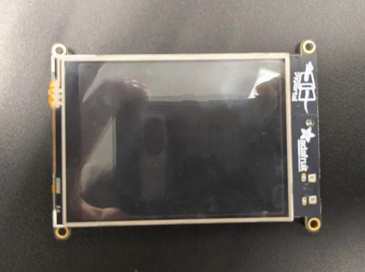


(Above) This is the PyPortal without the shell at all

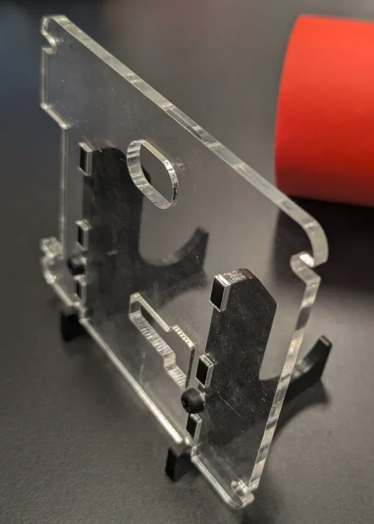


(Above) This is the PyPortal's back shell

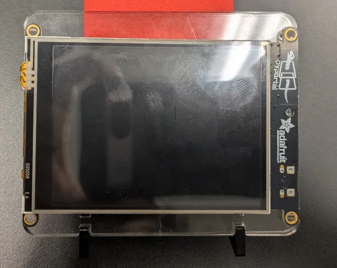


(Above) This is the PyPortal above the back of the shell

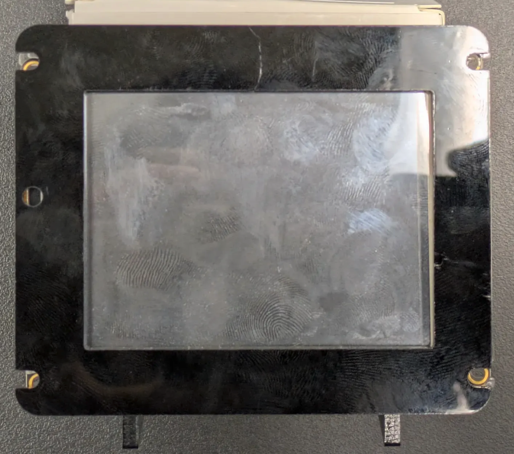


(Above) This is the PyPortal and all the component of its shell layered together, ready to be screwed in

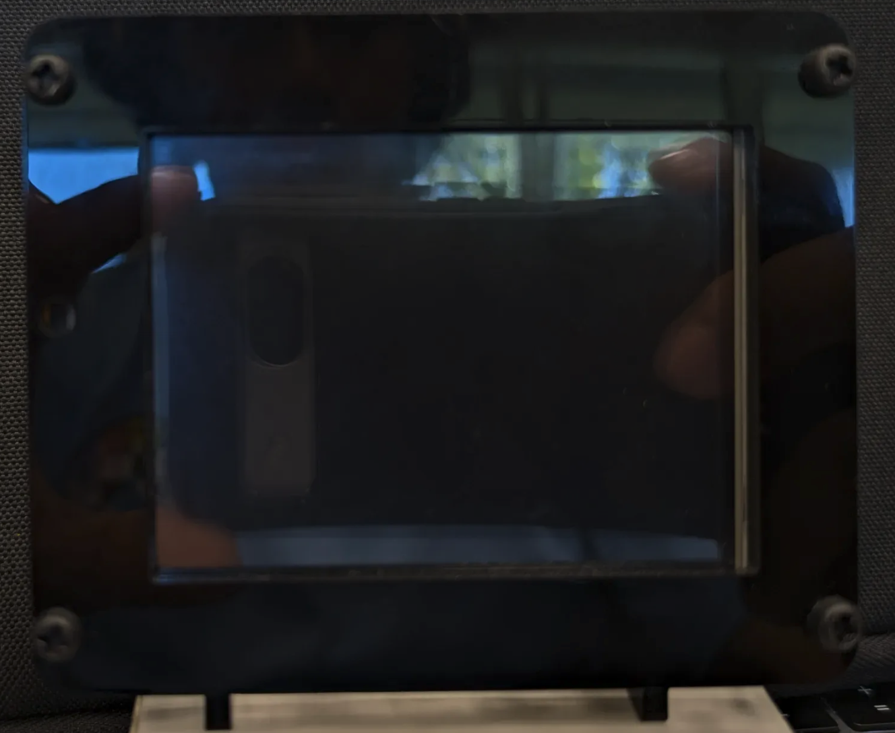


(Above) This is the Pyportal with all the screws in

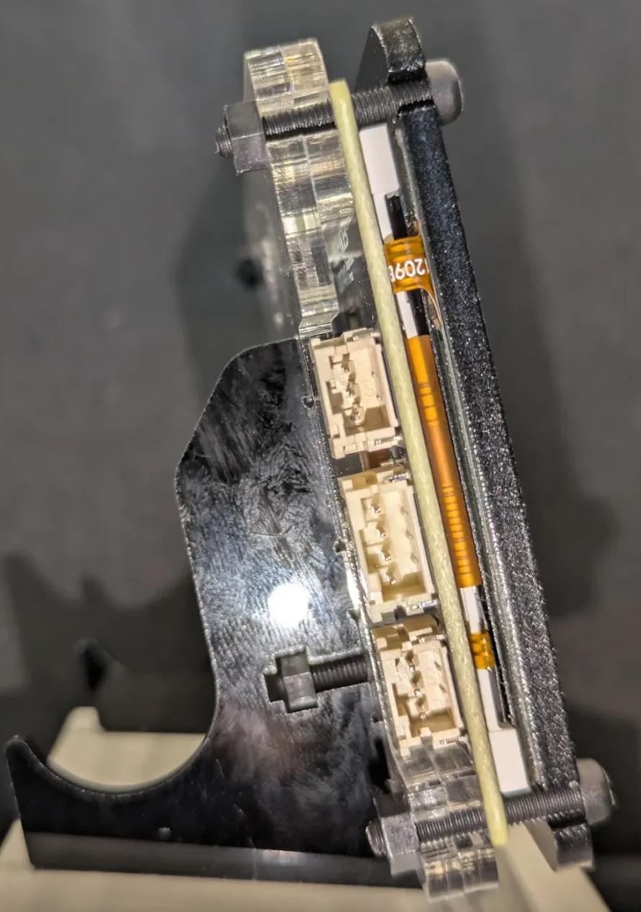
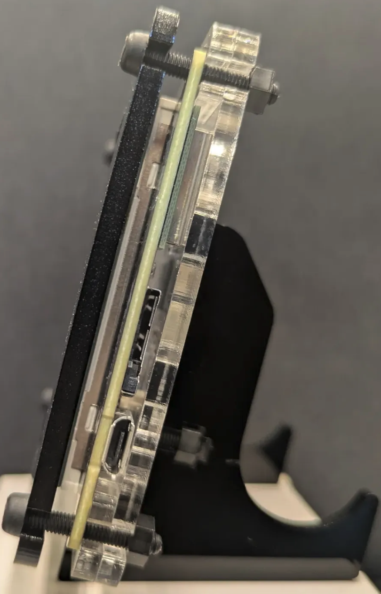

(Above) These are both the side views of the PyPortal


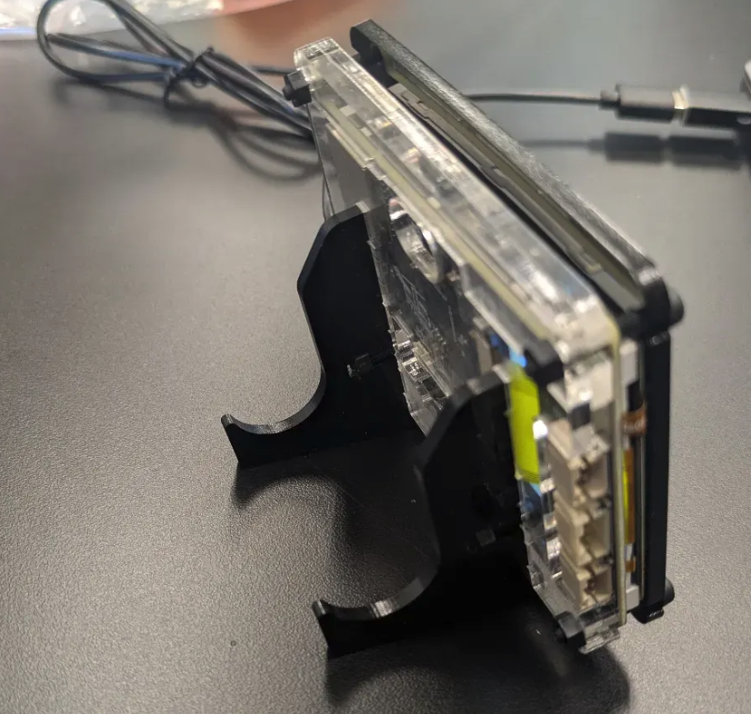

(Above) This is an isometric view of the back of the PyPortal


# Bill of Materials

| **Part** | **Note** | **Price** | **Link** |
|:--:|:--:|:--:|:--:|
| Adafruit PyPortal | It displays the location of the ISS, displays the map, and holds all the code for the ISS tracker | $54.95 | <a href="https://www.adafruit.com/product/4116"> Link </a> |
| Adafruit PyPortal Display Stand | A "shell" for the PyPortal, making it sturdier and easier to hold | $9.95 | <a href="https://www.adafruit.com/product/4146"> Link </a> |
| USB-A to USB-Micro cable | Connects the PyPortal to your computer | $4.00 | <a href="https://www.amazon.com/s?k=usb+a+to+usb+micro+cable&crid=2EEH9XWXH5G8H&sprefix=usb+a+to+usb+micro+%2Caps%2C149&ref=nb_sb_ss_p13n-pd-dpltr-ranker_1_19"> Link </a> |
<!--
# Other Resources/Examples
One of the best parts about Github is that you can view how other people set up their own work. Here are some past BSE portfolios that are awesome examples. You can view how they set up their portfolio, and you can view their index.md files to understand how they implemented different portfolio components.
- [Example 1](https://trashytuber.github.io/YimingJiaBlueStamp/)
- [Example 2](https://sviatil0.github.io/Sviatoslav_BSE/)
- [Example 3](https://arneshkumar.github.io/arneshbluestamp/)
-->
# Starter Project: Retro Arcade Console
<iframe width="500" height="281" src="https://www.youtube.com/embed/i_2Iimyn7tw?si=MvCyhHR4sTnx0RO8" title="YouTube video player" frameborder="0" allow="accelerometer; autoplay; clipboard-write; encrypted-media; gyroscope; picture-in-picture; web-share" referrerpolicy="strict-origin-when-cross-origin" allowfullscreen></iframe>

# Summary of Build 
Since it was a starter project, the build process was easy. There were instructions that I had to follow and I followed them with relative ease. The only difficulty I had was that I soldered one of the diplay panels incorrectly and it wasn't straight. the way it was oriented made it awkward to press the top button. Other than that, there weren't any difficulties.
# Picture of Retro Arcade Console
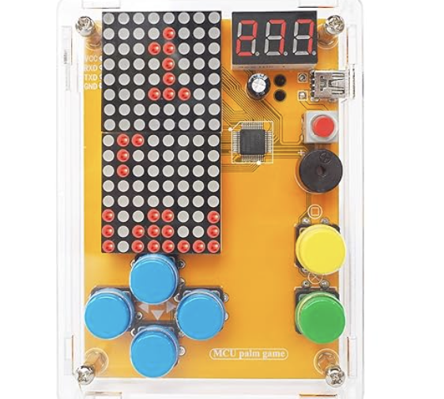

# Bill of Materials

| **Number** | **Part** | **Quantity** |
|:--:|:--:|:--:|
| 1 | 12mm 5V Passive Buzzer | 1
| 2 | 220uF 16V Electric Capacitor | 1
| 3 | 4-Pin 90° Micro USB |1
| 4 | 50cm Power Cable (For Micro USB) | 1
| 5 | 8x8 mm Self-Switch | 1
| 6 | Red Self-Switch Cap | 1 
| 7 | 3631AS Digitron Display | 1
| 8 | STC8H3K64S2 IC Chip | 1
| 9 | 1088BS 8x8 mm LED dot matrix module | 2
| 10 | A24 12x12x7 .3mm Button | 6
| 11 | A24 12x12x7 .3mm Button Cap | 6
| 12 | 7x9 .8mm PCB | 1
| 13 | M3x5mm Screw | 8
| 14 | M3x8mm Screw | 2
| 15 | Double-Pass M3x9mm | 4
| 16 | Single-Head 5+6mm Hexagonal Column | 4
| 17 | AAA Battery Case | 1
| 18 | Acrylic Shell | 6


